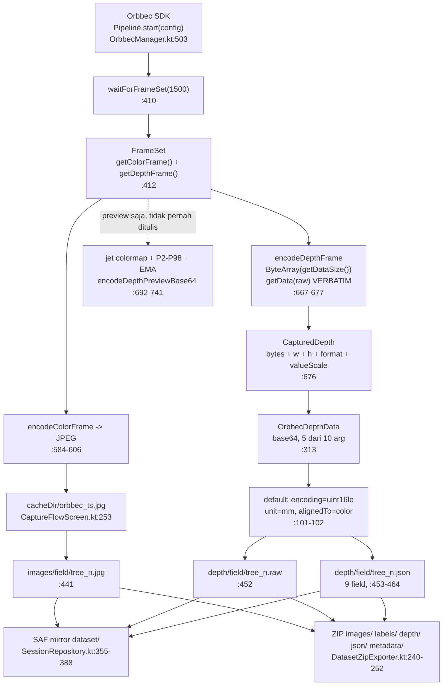

# Audit Implementasi PalmAnnotate — Kesiapan untuk Dataset YOLO RGB-D

Tanggal: 2026-07-24. Audit read-only, tidak ada kode yang diubah.
Basis: enam pass audit spesialis + satu pass verifikasi adversarial. Setiap klaim di bawah ini
punya cite `file:line` yang sudah dibaca ulang.

## 1. Vonis Utama

**TIDAK — jangan pakai build ini untuk koleksi data satu musim penuh apa adanya.**
Untuk uji lapangan singkat (satu blok, satu operator, satu run, sekali jalan): **YA, dengan syarat**
checklist on-device di Bagian 8 dijalankan dulu.

Kabar baiknya: hal yang paling Anda takutkan — depth disimpan sebagai PNG 8-bit atau ter-colourise —
**tidak terjadi**. Buffer uint16 mentah ditulis apa adanya (`OrbbecManager.kt:667-677`), jet colormap
hanya untuk preview. `valueScale` dibaca dari objek `DepthFrame` yang sama dengan byte yang disalin
(`OrbbecManager.kt:676`), jadi skala dan piksel tidak mungkin ketukar antar-frame. RGB dan depth
diambil dari satu `FrameSet` (`OrbbecManager.kt:412`), jadi sinkronisasi temporal aman by construction.

Yang rusak adalah semua yang **mengelilingi** byte itu: metadata alignment yang dikarang, penamaan
file yang bisa tabrakan lintas run, dan beberapa jalur kegagalan yang tidak bersuara.

| Aspek | Status | Alasan singkat |
|---|---|---|
| Orbbec acquisition | RISIKO | Pump path menerima frameset tanpa depth tanpa retry (`OrbbecManager.kt:417`); flapping guard mematikan depth permanen sampai reset (`:488`) |
| Depth persistence | AMAN | Raw uint16 verbatim, tanpa filter/clamp/colourise (`OrbbecManager.kt:667-677` → `CaptureFlowScreen.kt:451-452`) |
| Depth scale & units | AMAN dengan catatan | `valueScale` benar dan per-frame; tapi `unit:"mm"` hardcoded dan ambigu terhadap `encoding:"uint16le"` (`OrbbecManager.kt:101`) |
| RGB-depth alignment | RUSAK | `alignedTo:"color"` adalah default parameter Kotlin yang ditulis tanpa syarat (`OrbbecManager.kt:101`, `:313`, `CaptureFlowScreen.kt:460`); nol intrinsics/extrinsics |
| RGB-depth sync | AMAN | Satu `FrameSet` untuk colour + depth (`OrbbecManager.kt:412-418`) |
| Export & ZIP | RISIKO | Depth ikut ZIP (`DatasetZipExporter.kt:246-247`), tapi hilang senyap untuk tree hasil resume (`FolderResumeImporter.kt:239-253`) |
| Labels | RISIKO | EXIF orientation tidak pernah dibaca/di-set (UNVERIFIED di device); tidak ada clamp `[0,1]` saat serialize (`YoloParser.kt:66-77`) |
| Data integrity | RUSAK | Nama tree bisa tabrakan lintas run dan menimpa file lama tanpa peringatan (`SessionRepository.kt:79-92`) |

---

## 2. Jawaban Cepat: Ke Mana File Disimpan

Package debug: `dev.sawitulm.palmannotate.debug` (`app/build.gradle.kts:29,53`). Untuk release,
suffix `.debug` hilang.

**A. App-external (sumber kebenaran, DIHAPUS saat uninstall / Clear App Data)**
`AndroidStorageManager.kt:25-38`

```
/storage/emulated/0/Android/data/dev.sawitulm.palmannotate.debug/files/PalmAnnotate/
├── images/field/{tree}_{n}.jpg        ← RGB (:44)
├── labels/field/{tree}_{n}.txt        ← YOLO (:52)
├── depth/field/{tree}_{n}.raw         ← uint16 mentah (:57)
├── depth/field/{tree}_{n}.json        ← sidecar (:60)
├── metadata/{tree}.json               ← lat/lng + timestamp save (:65)
├── annotlog/field/{tree}_{n}.json     ← (:78)
├── Output JSON/{tree}.json            ← (:70)
├── Output TXT/field/                  ← DIBUAT TAPI SELALU KOSONG (:36, tidak ada writer)
├── exports/                           ← ZIP fallback (:37)
└── snapshots/                         ← tidak dipakai (:38)
```
Database Room: `/data/data/dev.sawitulm.palmannotate.debug/databases/palmannotate.db`
(`PalmAnnotateDatabase.kt:27`). **Ikut terhapus saat uninstall.**
Catatan: di Android 11+ (Pad 8 = Android 16) folder `Android/data/...` tidak bisa dibuka lewat
Files app bawaan.

**B. Folder SAF pilihan user (SURVIVE uninstall)** — `SessionRepository.kt:346-388`, `:408`

```
<folder yang dipilih operator>/
├── dataset/images/field/{tree}_{n}.jpg
├── dataset/depth/field/{tree}_{n}.raw   ← depth ikut ke sini (:373)
├── dataset/depth/field/{tree}_{n}.json  ← (:381)
├── dataset/metadata/{tree}.json
├── dataset/annotlog/field/{tree}_{n}.json
├── Output TXT/field/{tree}_{n}.txt      ← label YOLO (:346)
├── Output JSON/{tree}.json              ← (:408)
└── exports/<nama>.zip                   ← (DatasetZipExporter.kt:198)
```

**C. Isi ZIP** — `DatasetZipExporter.kt:240-252`

```
images/{tree}_{n}.jpg
labels/{tree}_{n}.txt
depth/{tree}_{n}.raw     ← YA, ikut
depth/{tree}_{n}.json    ← YA, ikut
json/{tree}.json
metadata/{tree}.json
```

**Jadi: file depth dan sidecar-nya MEMANG ada di dalam ZIP** (`DatasetZipExporter.kt:246-247`).
Dua catatan penting: (1) exporter hanya membaca dari storage lokal (`:182-189`) dan membuang entri
yang tidak ada tanpa peringatan (`:176-179`); (2) tidak ada `data.yaml` / `classes.txt` / README di
dalam ZIP — mapping kelas hanya tersirat lewat `class_name` di tiap `json/{tree}.json`
(`ExportManager.kt:74-76`).

---

## 3. Bagaimana Depth Sebenarnya Bekerja (alur nyata di kode)

Deskriptif, tanpa penilaian.

**Setup stream.** `acquireStreamLocked` (`OrbbecManager.kt:470-512`) memilih colour profile dan depth
profile lewat dua panggilan terpisah: `chooseColorProfile` (`:525-539`, filter `w>=640 && h>=360`,
sort MJPG-first lalu `|w-1280|`) dan `chooseDepthProfile` (`:541-554`, filter `w>=320 && h>=240`,
sort Y16-first lalu `|w-1280|`). Lalu `config.setAlignMode(ALIGN_D2C_SW_MODE)` (`:495`),
`setDepthScaleRequire(true)` (`:496`), `setFrameAggregateOutputMode(...ALL_TYPE_FRAME_REQUIRE)`
(`:497`), `depthEnabled = true` (`:498`), `pipeline.start(config)` (`:503`).

**Pump thread.** Thread `PalmAnnotate-OrbbecPump` (`:382`) polling `waitForFrameSet(1500)` (`:410`).
Colour dan depth diambil dari frameset yang sama (`:412`). Saat shutter ditekan, `pendingCapture`
(AtomicReference berisi `CaptureWaiter` dengan field `@Volatile` + `CountDownLatch`, `:106-117`)
di-drain di `:413-419`. Native frame ditutup di `finally` (`:430`).

**Encode.** `encodeDepthFrame` (`:667-677`): `ByteArray(frame.getDataSize())` → `frame.getData(raw)`
→ terima `Y16/Y10/Y11/Y12` apa adanya → `CapturedDepth(y16, width, height, format.name,
frame.getValueScale())`. Tidak ada decimation, hole filling, filter, atau clamp di jalur ini.

**Bungkus.** `capture()` (`:305-316`) → `OrbbecDepthData(base64, width, height, sourceFormat,
valueScale)` — hanya 5 dari 10 argumen, jadi `encoding`, `unit`, `alignedTo`, `displayFloorMm`,
`displayCeilingMm` selalu default deklarasi (`:99-103`).

**Tulis.** `CaptureFlowScreen.kt:449-469`: base64-decode → `depth/field/{tree}_{n}.raw` (`:452`),
sidecar 9 field → `{tree}_{n}.json` (`:464`), seluruhnya dalam satu `try/catch` yang hanya `Log.w`
(`:466-468`).

**Mirror + export.** `SessionRepository.mirrorSafArtifacts` (`:371-388`) mengangkat `.raw` + `.json`
ke folder SAF (sekali saja, di-guard `!saf.exists`). `DatasetZipLayout.zipEntriesFor`
(`DatasetZipExporter.kt:240-252`) memasukkan keduanya ke ZIP.



---

## 4. Temuan Kritis

Diurutkan berdasarkan severity, lalu seberapa senyap kegagalannya.

### [C-01] Nama tree bisa tabrakan lintas run — RGB tree baru berpasangan dengan depth tree lama
**Severity: CRITICAL** (gabungan D2-02, D4-01, D5-02, D6-02)

- **Lokasi:** `app/src/main/java/dev/sawitulm/palmannotate/data/storage/SessionRepository.kt:79-92`,
  `app/src/main/java/dev/sawitulm/palmannotate/ui/capture/CaptureFlowScreen.kt:427`,
  `app/src/main/java/dev/sawitulm/palmannotate/data/storage/AndroidStorageManager.kt:44-61`
- **Bukti:**
```kotlin
// SessionRepository.kt:79-92 — setiap run baru selalu nextId = 1, tanpa cek groupKey
sessionDao.upsert(SessionEntity(sessionId = id, ..., groupKey = groupKeyFor(variety, block),
    ..., nextId = 1, ...))

// CaptureFlowScreen.kt:427 — nama file murni fungsi variety+block+id
val treeName = if (b.isNotEmpty()) "${v}_${b}_${"%04d".format(treeId)}" else "${v}_${"%04d".format(treeId)}"

// AndroidStorageManager.kt:44,57 — path hanya dikunci oleh treeName
fun imageFile(treeName: String, sideIndex: Int) = File(imagesDir, "${treeName}_${sideIndex + 1}.jpg")
fun depthRawFile(treeName: String, sideIndex: Int) = File(depthDir, "${treeName}_${sideIndex + 1}.raw")
```
  `TreeEntity` tidak punya unique index pada `treeName` (`Entities.kt:37,39-51` — hanya
  `Index("sessionId")`), dan `TreeDao.getByName` (`Entities.kt:157-158`) **tidak punya satu pun
  caller** di seluruh `app/src`.
- **Kenapa ini merusak dataset RGB-D:** Hari-1 operator merekam blok A21B → `DAMIMAS_A21B_0001..0040`
  lengkap dengan depth. Hari-2 dia membuat run baru untuk blok yang sama (dialog New Session
  pre-fill variety dan block dari `InputCache`, `Dialogs.kt:32-33`). `nextId` mulai dari 1 lagi, jadi
  tree pertama hari-2 kembali bernama `DAMIMAS_A21B_0001`. `storage.writeBytes(dest, bytes)`
  (`CaptureFlowScreen.kt:441`) menimpa JPEG kemarin. Kalau sisi itu **tidak punya depth** hari ini
  (kamera tablet, atau depth drop), blok depth di `:449` tidak jalan sama sekali dan `.raw` milik
  tree kemarin tetap duduk di sana dengan nama yang sama persis. Jalur manual-ID lebih pendek lagi:
  `CaptureFlowScreen.kt:424` menerima ID apa pun yang diketik tanpa cek.
- **Dampak kalau tidak diperbaiki:** ML engineer menerima sampel dengan RGB pohon A dan channel D
  dari pohon B — dua adegan berbeda ditumpuk jadi satu tensor 4-channel. Kedua file valid, dimensi
  masuk akal, tidak ada file-existence check yang bisa mendeteksinya. Untuk kasus lain (kedua tree
  ada di DB dengan nama sama) `ZipOutputStream.putNextEntry` melempar `ZipException` di
  `DatasetZipExporter.kt:138` dan export gagal total tanpa menyebut tree mana penyebabnya.
- **Arah perbaikan:** Tambahkan unique index pada `treeName` di `TreeEntity`, atau panggil
  `TreeDao.getByName` yang sudah ada sebelum `addTree` dan tolak/peringatkan duplikat. Alternatif
  minimal: masukkan run id (atau tanggal) ke dalam `treeName` di `CaptureFlowScreen.kt:427`. Selama
  belum ada, satu blok = satu run, dan jangan pernah pakai manual ID untuk id yang sudah dipakai.

### [H-01] Sidecar menyatakan `alignedTo:"color"` tanpa syarat, bahkan ketika D2C align gagal
**Severity: HIGH** (ORB-01, D2-01, D3-05, D5-01)

- **Lokasi:** `app/src/main/java/dev/sawitulm/palmannotate/data/camera/OrbbecManager.kt:101`, `:313`,
  `:495`; `app/src/main/java/dev/sawitulm/palmannotate/ui/capture/CaptureFlowScreen.kt:460`
- **Bukti:**
```kotlin
// OrbbecManager.kt:495 — align gagal hanya di-log, eksekusi lanjut ke :498 depthEnabled = true
try { config.setAlignMode(AlignMode.ALIGN_D2C_SW_MODE) } catch (e: Exception) { Log.w(TAG, "software D2C align unavailable", e) }

// OrbbecManager.kt:101 — konstanta compile-time, bukan hasil pengukuran
val encoding: String = "uint16le", val unit: String = "mm", val alignedTo: String = "color",

// OrbbecManager.kt:313 — hanya 5 arg, jadi alignedTo TIDAK PERNAH selain "color"
OrbbecDepthData(Base64.encodeToString(it.bytes, Base64.NO_WRAP), it.width, it.height, it.sourceFormat, it.valueScale)

// CaptureFlowScreen.kt:460 — ditulis ke setiap sidecar
put("alignedTo", depth.alignedTo)
```
  Grep di `app/src` untuk `alignedTo` hanya menemukan tiga lokasi ini — tidak ada satu pun yang
  menurunkan nilainya dari kondisi pipeline sebenarnya.
- **Kenapa ini merusak dataset RGB-D:** `catch` di `:495` bersarang **di dalam** blok depth-setup,
  jadi kegagalan align tidak mematikan depth dan tidak menyentuh metadata. Kalau pada
  device/firmware tertentu SW D2C tidak tersedia (atau SDK menerima panggilan tapi diam-diam tidak
  meng-align karena pasangan profile depth+colour yang dipilih bukan kombinasi D2C yang didukung),
  stream tetap start, preview tetap normal, shutter tetap jalan, dan setiap sidecar tetap menyatakan
  `"alignedTo":"color"`.
- **Dampak kalau tidak diperbaiki:** Pipeline training menumpuk D di atas RGB dengan asumsi
  korespondensi per-piksel. Setiap bounding box mengambil statistik depth dari bagian scene yang
  salah — bergeser sebesar baseline colour/depth, yang pada jarak 1-3 m berarti puluhan piksel.
  Model dilatih pada D yang korup secara sistematis, dan tidak ada apa pun di dataset yang
  mengungkapnya.
- **Catatan verifikasi:** *Cacat kodenya* (konstanta yang dipersistensikan seolah hasil pengukuran)
  **VERIFIED**. Apakah `setAlignMode` benar-benar melempar exception atau diam-diam no-op pada
  Gemini 335L **UNVERIFIED** — itu perilaku native/JNI Orbbec yang tidak bisa dibaca dari repo ini.
- **Arah perbaikan:** Turunkan `alignedTo` dari hasil nyata: set flag di blok `try` `:495` dan
  teruskan flag itu ke `OrbbecDepthData` alih-alih memakai default. Kalau align gagal, tulis
  `"alignedTo":"none"` (atau hilangkan field-nya sama sekali) — sidecar yang jujur bisa dibetulkan
  offline, sidecar yang bohong tidak.

### [H-02] Save tanpa depth tidak pernah menghapus file depth lama untuk tree/side yang sama
**Severity: HIGH** (D5-03)

- **Lokasi:** `app/src/main/java/dev/sawitulm/palmannotate/ui/capture/CaptureFlowScreen.kt:449`
- **Bukti:**
```kotlin
// :441 — image ditimpa tanpa syarat
storage.writeBytes(dest, bytes)
// :449 — depth HANYA ditulis kalau ada. Tidak ada else { deleteFile(depthRawFile(...)) }
capturedDepths.getOrNull(index)?.let { depth -> ... }
```
  `AndroidStorageManager.deleteFile` ada di `:100` tapi hanya dipanggil dari `deleteTree` (`:113-126`).
- **Kenapa ini merusak dataset RGB-D:** Operator memotret tree 12 dengan Orbbec (depth tersimpan),
  sadar side 2-3 blur, kembali, mengetik ID 12 lagi (`CaptureFlowScreen.kt:424` mengizinkan), tapi
  kali ini USB camera sudah turun ke mode color-only (`OrbbecManager.kt:488`) atau dia pakai kamera
  tablet. Empat JPEG baru menimpa yang lama; empat `.raw` LAMA tetap di tempat dengan nama cocok dan
  sidecar yang masih menyatakan `alignedTo:"color"`.
- **Dampak kalau tidak diperbaiki:** Empat sampel dengan channel D dari pengambilan berbeda (blur,
  pose berbeda) tapi terlihat sepenuhnya valid. Depth yang "masuk akal tapi salah" lebih merusak
  training daripada D = 0.
- **Arah perbaikan:** Tambahkan `else` branch di `:449` yang menghapus `depthRawFile` dan
  `depthJsonFile` untuk index tersebut. Dua baris, dan menutup separuh permukaan C-01 juga.

### [H-03] Tidak ada intrinsics, extrinsics, distortion, atau calibration yang pernah dibaca
**Severity: HIGH** (ORB-02)

- **Lokasi:** `app/src/main/java/dev/sawitulm/palmannotate/data/camera/OrbbecManager.kt:470`
  (seluruh setup stream), `app/src/main/java/dev/sawitulm/palmannotate/ui/capture/CaptureFlowScreen.kt:453-463`
- **Bukti:** Grep di seluruh `app/src` untuk `intrinsic|Intrinsic|extrinsic|Extrinsic|distortion|CameraParam|CalibrationParam`
  → **no matches**. Padahal AAR yang di-bundle mengekspos semuanya
  (`javap` atas `app/libs/obsensor_v2.0.6_2026031801_release.aar!classes.jar`):
```
VideoStreamProfile: getIntrinsic(); getDistortion();
StreamProfile:      getExtrinsicTo(StreamProfile);
Pipeline:           getCameraParam(); getCalibrationParam(Config);
```
  Sidecar (`CaptureFlowScreen.kt:453-463`) berisi tepat sembilan field: width, height, format,
  valueScale, encoding, unit, alignedTo, displayFloorMm, displayCeilingMm.
- **Kenapa ini merusak dataset RGB-D:** Satu musim koleksi selesai. Di meja, seseorang sadar depth
  dan RGB tidak lurus — atau tidak bisa membuktikan bahwa mereka lurus. Karena tidak ada
  fx/fy/cx/cy, tidak ada koefisien distortion, dan tidak ada extrinsic depth→colour, tidak ada cara
  memproyeksikan ulang depth ke frame colour setelah kejadian, dan tidak ada cara bahkan untuk
  *mengukur* seberapa besar misalignment-nya.
- **Dampak kalau tidak diperbaiki:** Syarat "misalignment harus dicatat supaya bisa diperbaiki
  offline" tidak terpenuhi. Dataset entah benar karena beruntung, atau permanen tidak terpakai —
  tanpa opsi ketiga dan tanpa cara tahu yang mana.
- **Arah perbaikan:** Ini pasangan asuransi untuk H-01. Panggil `Pipeline.getCameraParam()` satu kali
  setelah `pipeline.start(config)` (`OrbbecManager.kt:503`) dan simpan hasilnya ke sidecar. Sadar
  bahwa ini secara teknis penambahan fitur, bukan perbaikan bug — tapi tanpa itu H-01 tidak bisa
  dipulihkan.

### [H-04] Resume-from-folder tidak menyalin depth kembali — ZIP untuk tree hasil resume kosong depth
**Severity: HIGH** (D2-09, D4-02, D5-07, D3-13, D6-09)

- **Lokasi:** `app/src/main/java/dev/sawitulm/palmannotate/data/storage/FolderResumeImporter.kt:239-253`,
  `app/src/main/java/dev/sawitulm/palmannotate/data/export/DatasetZipExporter.kt:176-189`
- **Bukti:**
```kotlin
// FolderResumeImporter.kt:239-253 — hanya .jpg. Grep 'depth' di file ini: nol hasil.
private fun copyImageToPrimary(safTreeUri: Uri, treeName: String, sideIndex: Int, imageNames: Set<String>): Uri? {
    val fileName = "${treeName}_${sideIndex + 1}.jpg"
    ...
}
// DatasetZipExporter.kt:185-186 — depth hanya di-resolve dari storage LOKAL
FileKind.DEPTH_RAW  -> storage.depthRawFile(treeName, spec.sideIndex!!)
FileKind.DEPTH_JSON -> storage.depthJsonFile(treeName, spec.sideIndex!!)
// :176-179 — yang tidak ada dibuang tanpa sepatah kata
if (f.exists() && f.isFile) FileEntry(f, spec.zipPath) else null
```
- **Kenapa ini merusak dataset RGB-D:** Alasan `DatasetZipExporter` ada, menurut KDoc-nya sendiri
  (`:31-35`), adalah karena app-external storage terhapus oleh Clear App Data / uninstall. Jadi jalur
  pemulihan yang dimaksud adalah: reinstall → pilih folder SAF → `resumeFromFolder` membangun ulang
  run. Import itu menyalin JPEG, tapi `.raw`/`.json` yang sudah rajin di-mirror
  (`SessionRepository.kt:371-388`) tidak pernah dibaca balik.
- **Dampak kalau tidak diperbaiki:** Operator menekan "Export All", progress bar sampai 100%, tidak
  ada error — dan ZIP berisi `images/`, `labels/`, `json/`, `metadata/` dengan `depth/` kosong atau
  parsial. Yang parsial lebih berbahaya: tree yang baru direkam punya depth, tree hasil resume tidak,
  dan tidak ada yang membedakannya. Depth-nya sendiri masih ada di folder SAF, jadi bisa diselamatkan
  manual — tapi tidak ada yang tahu harus mencari.
- **Arah perbaikan:** Tambahkan `copyDepthToPrimary` sejajar `copyImageToPrimary` di
  `FolderResumeImporter`, atau minimal buat `entriesForTree` menghitung berapa spec yang di-drop dan
  melaporkannya di hasil export.

### [H-05] Kegagalan tulis SAF mengembalikan `false` yang dibuang semua caller; UI tetap bilang "exported"
**Severity: HIGH** (D4-04)

- **Lokasi:** `app/src/main/java/dev/sawitulm/palmannotate/data/storage/SafMirrorStore.kt:135-161`,
  `app/src/main/java/dev/sawitulm/palmannotate/ui/results/ResultsScreen.kt:163-171`
- **Bukti:**
```kotlin
// SafMirrorStore.kt:142,154-160 — semua kegagalan jadi `false`, exception ditelan
val dir = resolveDir(treeUri, dirSegments, create = true) ?: return false
... openOutputStream(targetUri, "wt")?.use { it.write(data) } ?: return false
} catch (e: Exception) { Log.w(TAG, "writeBytes failed for $relPath", e); return false }

// ResultsScreen.kt:163-171 — status di-set setelah action() return normal
try { action(safUri); exportStatus = "$actionLabel exported" }
```
  Boolean dibuang di `ResultsScreen.kt:183, 192, 201, 208` dan
  `SessionRepository.kt:148, 346, 350, 360, 376, 384, 408`. `SafMirrorStore.isFolderAccessible`
  (`:95-105`) ada dan **nol caller**.
- **Kenapa ini merusak dataset RGB-D:** Grant URI persisten hilang (operator cabut izin di Settings,
  microSD di-remount dengan volume UUID baru, folder dihapus/di-rename dari PC).
  `exportFolder.folderUri.first()` tetap mengembalikan string URI lama, jadi tidak ada yang
  mendeteksi. `resolveDir` mengembalikan null, `writeBytes` mengembalikan false, Boolean dibuang,
  tidak ada exception, dan `exportGated` menyetel `exportStatus = "YOLO exported"` → toast hijau.
- **Dampak kalau tidak diperbaiki:** Operator menghabiskan satu hari penuh percaya dataset sedang
  di-mirror ke removable storage. Tidak. Satu-satunya salinan ada di folder app-private yang akan
  terhapus saat reinstall. Kegagalan hanya terlihat di logcat.
- **Arah perbaikan:** Panggil `isFolderAccessible` yang sudah ada saat masuk Results/Home, dan
  periksa nilai Boolean dari `writeText`/`writeBytes` minimal di `exportGated` sebelum menyetel
  `exportStatus`.

### [H-06] JPEG kamera tablet membawa EXIF orientation yang app-nya sendiri abaikan
**Severity: HIGH — UNVERIFIED di device** (D4-06)

- **Lokasi:** `app/src/main/java/dev/sawitulm/palmannotate/ui/capture/CaptureFlowScreen.kt:1051`,
  `:442-446`; `app/src/main/java/dev/sawitulm/palmannotate/ui/common/AnnotationCanvas.kt:127-135`
- **Bukti:**
```kotlin
// CaptureFlowScreen.kt:1051 — tidak ada setTargetRotation, tidak ada rotation listener
val imageCapture = remember { ImageCapture.Builder().build() }
// :442-446 — dimensi dibaca dari buffer piksel MENTAH; BitmapFactory mengabaikan EXIF
BitmapFactory.decodeFile(dest.path, dims)
```
  Grep `Exif` di seluruh `app/src` → nol hasil. Grep `setTargetRotation|screenOrientation` → nol
  hasil, dan `AndroidManifest.xml` tidak mengunci orientasi (hanya `configChanges`).
- **Kenapa ini merusak dataset RGB-D:** Di dalam app semuanya konsisten karena `BitmapFactory`
  mengabaikan EXIF di kedua tempat (pembacaan dimensi dan canvas anotasi), jadi operator menggambar
  box yang terlihat benar. ZIP mengirim JPEG byte-identical dengan tag utuh. Di hilir, `cv2.imread()`
  menerapkan EXIF orientation secara default (dan PIL lewat `ImageOps.exif_transpose`), jadi gambar
  training terotasi 90° sementara file label YOLO masih mendeskripsikan frame yang belum dirotasi —
  width dan height ikut bertukar.
- **Dampak kalau tidak diperbaiki:** Setiap box di setiap side kamera-tablet salah, dan terlihat
  baik-baik saja di app. **Batasan:** ini hanya menyentuh side PHONE_CAMERA — jalur Orbbec menulis
  byte JPEG dari SDK (`CaptureFlowScreen.kt:250-254`) yang tidak punya tag orientation, jadi sampel
  yang membawa depth tidak terkena mekanisme ini. Nilai tag EXIF yang benar-benar ditulis CameraX
  **tidak bisa diverifikasi dari source** — harus dicek dengan `exiftool` pada file nyata.
- **Arah perbaikan:** Cek dulu di device (lihat checklist §8 nomor 6). Kalau tag ≠ 1, panggil
  `imageCapture.setTargetRotation(...)` atau normalkan orientasi saat menyalin file di `:441`.

### [H-07] Membuka Dedup / Results / Depth dari menu More tidak menyimpan — anotasi hilang senyap
**Severity: HIGH** (D6-06)

- **Lokasi:** `app/src/main/java/dev/sawitulm/palmannotate/ui/carousel/CarouselScreen.kt:484-500`, `:376`
- **Bukti:**
```kotlin
onClick = { showMoreMenu = false; onDedup() },      // :488 — tanpa save
onClick = { showMoreMenu = false; onResults() },    // :493 — tanpa save
LaunchedEffect(sessionId) { viewModel.load(sessionId) }   // :376 — kembali = reload dari DB
```
  Semua jalan keluar lain menyimpan: Back arrow (`:452`), BackHandler (`:425`), Next Tree (`:524-528`).
  `autoSave()` hanya menyala pada ganti side (`:121`) dan toggle mode (`:142`).
- **Kenapa ini merusak dataset RGB-D:** Operator mengubah kelas box (`changeBboxClass`, `:181-185`,
  jalan di mode REVIEW dan menyetel `dirty` tanpa autosave), lalu buka More → Deduplication tanpa
  swipe. `DedupViewModel` memuat tree dari DB (tanpa perubahan itu), operator mengonfirmasi link, dan
  `saveAndContinue` menulis balik daftar box pra-edit.
- **Dampak kalau tidak diperbaiki:** Perubahan kelas hilang dari DB dan dari YOLO label, tanpa error.
  Output JSON dan label difinalisasi tanpa perubahan itu.
- **Arah perbaikan:** Panggil `autoSave()` (atau `save()`) di ketiga `onClick` menu More.

### [H-08] `detectCurrentSide()` menulis hasil inferensi ke side yang aktif SETELAH model selesai
**Severity: HIGH** (D6-03)

- **Lokasi:** `app/src/main/java/dev/sawitulm/palmannotate/ui/carousel/CarouselScreen.kt:311-350`
- **Bukti:**
```kotlin
val side = currentSide ?: return              // :312 — TreeSide di-capture SEKARANG
val detections = detector.detect(uri)         // :317 — suspend beberapa detik
updatedSides[currentSideIndex] = side.copy(   // :344 — index dibaca SETELAHNYA
```
- **Kenapa ini merusak dataset RGB-D:** Operator di side 1, tekan tombol Detect, lalu swipe ke side 2
  selagi spinner berputar (`userScrollEnabled` di `:544` tidak memblokir saat `isDetecting`). Saat
  detect selesai, `updatedSides[1]` diganti **salinan side 1** — termasuk `sideIndex = 0` dan
  `imageUri` side 1, karena `copy` mempertahankannya.
- **Dampak kalau tidak diperbaiki:** Anotasi side 2 hilang; list punya dua entri `sideIndex = 0`;
  `persistSidesDb` (`SessionRepository.kt:293-307`) menulis dua baris `sideIndex 0` dan
  `writeLocalArtifacts` (`:328-331`) menulis teks YOLO side 1 dua kali ke file yang sama, meninggalkan
  `..._2.txt` basi di disk dan di SAF. Tidak sepenuhnya senyap — carousel akan menampilkan foto yang
  sama di dua halaman, jadi operator berpeluang melihatnya.
- **Arah perbaikan:** Simpan index di variabel lokal sebelum `launch`, dan bandingkan lagi setelah
  `detect()` kembali (atau nonaktifkan swipe selama `isDetecting`).

### [H-09] Room dibangun dengan `fallbackToDestructiveMigration()` dan `exportSchema = false`
**Severity: HIGH** (D6-01, D4-03)

- **Lokasi:** `app/src/main/java/dev/sawitulm/palmannotate/data/db/PalmAnnotateDatabase.kt:16-38`
- **Bukti:**
```kotlin
version = 2, exportSchema = false,            // :16-17
// Debug app: ... No production data to migrate.   // :35-36 — komentar ini sudah tidak benar
.fallbackToDestructiveMigration()             // :37
```
- **Kenapa ini merusak dataset RGB-D:** Perubahan entity apa pun (tambah satu kolom, misalnya flag
  alignment untuk memperbaiki H-01) menaikkan `version` ke 3, dan pada update APK berikutnya di
  lapangan Room men-drop semua tabel. Flag ini juga menyala pada **downgrade** — side-load build lama
  di atas build baru, yang sangat mungkin terjadi saat uji lapangan.
- **Dampak kalau tidak diperbaiki:** JPEG, `.raw`, dan `.txt` selamat di storage, tapi semua bbox,
  class assignment, dan cross-side link hilang. Pemulihan hanya lewat `FolderResumeImporter` yang
  membaca `Output JSON/` — dan tree yang belum pernah difinalisasi tidak punya Output JSON.
  `exportSchema = false` berarti tidak ada schema JSON tersimpan, jadi migration yang benar bahkan
  tidak bisa ditulis setelah kejadian.
- **Arah perbaikan:** Nyalakan `exportSchema = true` sekarang (supaya schema v2 terekam), lalu ganti
  `fallbackToDestructiveMigration()` dengan Migration eksplisit sebelum bump versi berikutnya.

---

## 5. Temuan Sedang dan Rendah

| ID | Temuan | Lokasi | Dampak | Sev |
|---|---|---|---|---|
| ORB-03 | `unit:"mm"` hardcoded padahal piksel mentah dalam satuan `valueScale` (0.1 mm di Gemini 335L) | `OrbbecManager.kt:101` | Konsumen yang percaya `unit` dapat depth 10x terlalu besar; app sendiri pernah salah baca (`docs/MIGRATION_STATUS.md:7-23`). Data tetap pulih lewat `valueScale` di file yang sama | MED |
| ORB-04 / D5-04 | Pump path menerima frameset tanpa depth tanpa retry; fallback path punya guard `wantDepth` | `OrbbecManager.kt:417` vs `:575` | Side jadi RGB-only senyap. Ada modal WARN pra-save (`QualityCheck.kt:56-59`) tapi bisa di-dismiss | MED |
| ORB-05 / D3-10 | `encodeDepthFrame` tidak memvalidasi `bytes.size == width*height*2`; preview encoder punya cek itu (`:698`) | `OrbbecManager.kt:672-676` | `.raw` pendek/kosong ditulis dengan sidecar berdimensi penuh. `copied == 0` lolos guard | MED |
| ORB-06 / D5-05 | Depth profile dipilih independen dari colour profile; `Pipeline.getD2CDepthProfileList()` ada di AAR tapi tidak dipakai | `OrbbecManager.kt:541`, `:486-494` | Aspect ratio bisa beda (16:9 vs 16:10). Bisa dideteksi offline: depth w/h di sidecar, RGB w/h di `json/{tree}.json` (`ExportManager.kt:86-87`) | MED |
| ORB-09 | Release build menyalakan R8 padahal CLAUDE.md melarangnya | `app/build.gradle.kts:44` | Orbbec frame path "one frame then freeze". Laten: tidak ada signingConfig, jadi `assembleRelease` belum bisa di-side-load | MED |
| ORB-10 / D2-06 | Kegagalan tulis sidecar depth ditelan `Log.w`; jalur RGB dua baris di atasnya justru fail-loud | `CaptureFlowScreen.kt:466` vs `:440` | Partial write (raw sukses, json gagal) → `.raw` terpotong tanpa sidecar; viewer menebak geometri dan `valueScale = 1.0` | MED |
| ORB-12 | Flapping guard turun ke color-only untuk sisa pipeline session; `openSdkLocked` no-op kalau sudah streaming | `OrbbecManager.kt:176`, `:488`, `:451` | Dua detach USB dalam 20 s → depth mati sampai reset. Tombol Reset hanya dirender di branch "no device" (`CaptureFlowScreen.kt:1371-1381`) | MED |
| D2-04 | `.raw` dan `.json` ditulis non-atomic, tanpa temp+rename, tanpa `fd.sync()` | `AndroidStorageManager.kt:88-91` | Power loss di tengah save meninggalkan raw yatim atau terpotong | MED |
| D4-05 | ZIP jatuh diam-diam ke storage app-private saat SAF tidak tersedia; toast tidak menyebut path | `DatasetZipExporter.kt:196-215`, `HomeScreen.kt:254-266` | ZIP nyasar ke folder yang tidak bisa dibuka di Android 11+ | MED |
| D6-04 | Mutex autosave hanya menyerialkan autosave-vs-autosave; `save()`, `saveAndExit()` dan tiga save Dedup melewatinya | `CarouselScreen.kt:154-174`, `:289-309` | Snapshot basi bisa commit terakhir; `rewroteSides` hanya membandingkan jumlah side | MED |
| D6-05 | `autoSave()` menghapus `dirty` sebelum save jalan dan tidak punya `catch` | `CarouselScreen.kt:160-174` | Save gagal = edit hilang permanen (tidak ada retry) + exception lolos ke default handler | MED |
| D6-14 | `getBestLocation()` selalu memilih last-known fix tanpa batas umur; accuracy dan waktu fix tidak disimpan | `GpsProvider.kt:162-169`, `SessionRepository.kt:174-186` | Fix basi berkilometer distempel seolah segar; tidak bisa dideteksi offline | MED |
| ORB-07 / D5-09 | Tidak ada timestamp per-frame; `Frame.getTimeStamp*()` dan `Pipeline.enableFrameSync()` ada di AAR, tidak dipakai | `OrbbecManager.kt:667`, `CaptureFlowScreen.kt:453-463` | Skew RGB↔depth tidak bisa diaudit offline (tapi pairing sudah aman by construction lewat satu FrameSet) | LOW |
| ORB-08 | Y10/Y11/Y12 diterima dan ditulis dengan label `uint16le` tanpa cek bit-depth | `OrbbecManager.kt:764`, `:675` | Kalau ter-packed, seluruh file salah parse. Mitigasi: `depthFormatPriority` (`:765`) menaruh Y16 pertama, dan `format` sebenarnya tercatat di sidecar | LOW |
| ORB-14 / D3-04 | Depth viewer menebak lebar gambar saat `width*height != pixelCount`, default hardcoded 1280 | `DepthViewerScreen.kt:149-161` | Satu-satunya tempat operator bisa menangkap file depth rusak justru menyembunyikannya | LOW |
| ORB-15 / D3-06 | Sidecar tidak mencatat sentinel hole; `displayFloorMm`/`displayCeilingMm` konstanta 250/7000 duduk di antara metadata asli | `OrbbecManager.kt:87-88`, `:102` | Konsumen bisa salah anggap sebagai valid-range. Pada device 0.1 mm, ceiling 7000 mm > maks uint16 (6553.5 mm) | LOW |
| D3-07 | Jendela keras 250-7000 mm di preview DAN viewer | `DepthViewerScreen.kt:145`, `OrbbecManager.kt:727` | File dengan depth >7 m tampil "No valid depth values" padahal isinya benar; bisa membuat operator mengubah geometri pengambilan | LOW |
| D3-09 | "Valid pixels: N" tanpa denominator dan tanpa threshold | `DepthViewerScreen.kt:295` | Frame dengan coverage 0,5% terlihat sebagai angka lima digit yang meyakinkan | LOW |
| D6-08 | `_confirmedLinks` memakai `b{index}` atas array yang menyertakan box unassigned; `labels/*.txt` membuangnya | `ExportManager.kt:154`, `:245` | Invariant di KDoc `OutputSchema.kt:11-15` salah. Output JSON sendiri tetap konsisten; training input tidak terpengaruh | LOW |
| D6-10 | Union-Find bisa menggabungkan dua box dari SIDE YANG SAMA lewat ring wrap-around | `ResultsComputer.kt:44-63` | `summary.by_class` kurang satu bunch. Tidak menyentuh labels/*.txt | LOW |
| D4-11 | `YoloParser.serialize` tidak meng-clamp ke `[0,1]` | `YoloParser.kt:66-77` | Aman hari ini (semua producer clamp), tapi `FolderResumeImporter.kt:163-169` sudah memasukkan Bbox dari JSON tanpa clamp | LOW |
| D4-07 | Tidak ada `data.yaml`/`classes.txt`/README di ZIP | `DatasetZipExporter.kt:240-252` | Mapping kelas hanya tersirat lewat `class_name` per anotasi; aturan decode depth hanya per-file | LOW |
| D4-13 | `ExportManager.writeExports` dead code; `Output TXT/field/` lokal dibuat tapi tidak pernah diisi | `ExportManager.kt:315`, `AndroidStorageManager.kt:36` | Menyesatkan siapa pun yang memeriksa tablet | INFO |
| D3-11 | CLAUDE.md §"Depth Viewer (Jet Colormap)" salah pada 2 dari 3 klaim | `CLAUDE.md:103` | "No padding, no clamping" salah (`DepthUtil.kt:44`); "matching the Orbbec live preview" salah (`OrbbecManager.kt:734-741` pakai pad 5% + EMA 0.40 + min-span 120 mm) | INFO |
| D4-12 | Perilaku ZIP64 di atas 4 GB tidak terverifikasi | `DatasetZipExporter.kt:134` | Kemungkinan besar aman (ojluni OpenJDK-derived), tapi perlu satu tes device. Batas 65535 entri tidak relevan (~18 entri/tree) | INFO |

---

## 6. Yang Sudah Benar

Bagian-bagian ini **jangan disentuh** — implementasinya benar dan beberapa sudah menyelesaikan
masalah yang biasanya menghancurkan dataset RGB-D:

- **Depth disimpan lossless.** `encodeDepthFrame` (`OrbbecManager.kt:667-677`) menyalin buffer SDK
  verbatim: tidak ada `Bitmap`, tidak ada colormap, tidak ada rescale, tidak ada decimation, tidak
  ada hole filling, tidak ada clamp. `CaptureFlowScreen.kt:451-452` menulis persis byte itu. Grep
  `PNG|\.png` di `app/src/main/java` → nol hasil. Piksel 0 (hole) selamat byte-for-byte.
- **Preview tidak pernah bocor ke disk.** Jet colormap, P2-P98 stretch, dan EMA range smoothing
  seluruhnya hidup di `encodeDepthPreviewBase64` (`OrbbecManager.kt:692-741`) dan `DepthViewerScreen`,
  keduanya berakhir sebagai `ImageBitmap` di memori.
- **`valueScale` tidak mungkin desync.** Dibaca dari `frame.getValueScale()` pada objek `DepthFrame`
  yang byte-nya baru saja disalin (`OrbbecManager.kt:676`), dalam satu ekspresi return.
- **Sinkronisasi temporal RGB↔depth aman by construction.** Keduanya diambil dari satu `FrameSet`
  hasil satu `waitForFrameSet` (`OrbbecManager.kt:410-412`), dan `:497` juga meminta
  `OB_FRAME_AGGREGATE_OUTPUT_ALL_TYPE_FRAME_REQUIRE`. Tidak ada jalur di mana depth dari device USB
  bisa berpasangan dengan RGB dari kamera tablet — jalur PHONE_CAMERA tidak pernah menghasilkan depth.
- **Tidak ada torn frame.** `CaptureWaiter` memakai field `@Volatile` + `CountDownLatch`
  (`OrbbecManager.kt:106-117`); setiap frameset di-decode penuh ke array JVM dalam satu iterasi loop
  dan native frame ditutup di `finally` (`:430`).
- **Endianness bersih.** Hanya ada dua situs decode 16-bit — `DepthUtil.kt:19` dan
  `OrbbecManager.kt:709` — keduanya `(raw[i*2] and 0xFF) or ((raw[i*2+1] and 0xFF) shl 8)`, masking
  kedua byte jadi tidak ada sign-extension. Grep `ByteBuffer|ShortBuffer|ByteOrder|asShortBuffer|getShort`
  di `app/src` → nol hasil, jadi tidak ada jalur buffer yang bisa lupa `order(LITTLE_ENDIAN)`.
- **Depth tidak pernah di-resample.** Tidak ada `BitmapFactory` atau `createScaledBitmap` di jalur
  depth. Decimation satu-satunya adalah stride nearest-neighbour untuk preview
  (`OrbbecManager.kt:700-715`). Resampler yang menghaluskan (`AnnotationCanvas.kt:134`,
  `OnnxDetector.kt:127`) hanya menyentuh RGB.
- **Depth ikut ke ZIP dan ke folder SAF.** `DatasetZipLayout.zipEntriesFor` (`DatasetZipExporter.kt:246-247`)
  dan `mirrorSafArtifacts` (`SessionRepository.kt:371-388`).
- **Deteksi ONNX tidak bisa bocor ke label.** Deteksi dibuat `unassigned` (`CarouselScreen.kt:339`),
  dan baik `YoloParser.serialize` (`:69`) maupun `generateYoloTxt` (`ExportManager.kt:245`) memfilter
  `classId in 0..3`. Prediksi yang belum direview tidak akan pernah masuk `labels/*.txt`.
- **DAO disiplin soal REPLACE vs UPDATE.** `Entities.kt:128-134,166-171` mendokumentasikan bahwa
  REPLACE = DELETE+INSERT yang akan cascade-delete anak, dan repository memakai `update` saat
  membalik `nextId`/`isComplete` (`SessionRepository.kt:141,165,404`).
- **Save path sudah dipisah dengan benar.** DB + label lokal sinkron (~15 ms), SAF mirror di
  background `safScope` (`SessionRepository.kt:61`) — jangan pindahkan SAF kembali ke jalur blocking.
- **Test domain murni solid.** `DomainTests.kt`, `ExportTests.kt`, `DepthUtilTests.kt` menutup
  YoloParser, UnionFind, ResultsComputer, SessionUseCases, QualityCheck, dan matematika depth.

---

## 7. Yang Diperiksa Tapi Ternyata Aman

Klaim-klaim ini sempat diangkat lalu **dibantah** saat verifikasi — jadi Anda tahu ini sudah
diperiksa, bukan terlewat:

1. **"Sidecar bilang `unit:"mm"` padahal isinya satuan valueScale, jadi datanya salah 10x."**
   Dibantah sebagai *defect*: `put("valueScale", ...)` ada tepat di baris sebelumnya
   (`CaptureFlowScreen.kt:457`), dan `getValueScale()` memang konvensi Orbbec untuk pengali ke mm.
   Datanya pulih penuh; ini ambiguitas penamaan (tetap dicatat sebagai ORB-03 MEDIUM), bukan data salah.
2. **"`valueScale` diserialisasi sebagai double dan menghasilkan artefak float `0.10000000149011612`."**
   Dibantah lewat bytecode: `javap` atas class hasil kompilasi menunjukkan `Boxing.boxFloat` →
   `JSONObject.put(String, Object)`, dan `numberToString` mengembalikan `Float.toString(0.1f)` = `"0.1"`.
   Sidecar berisi `"valueScale":0.1`.
3. **"Race side-index di `captureOrbbecFrame` bisa menempelkan depth satu side ke RGB side lain
   selama 6 detik."** Dibantah: `orbbec.capture()` sudah selesai di `:250` sebelum kedua pembacaan
   `currentSide`. Jendelanya hanya satu dispatch ke main looper (sub-milidetik), bukan 6 detik, dan
   kalau tap mendarat sebelum `:255` kedua pembacaan melihat index yang sama sehingga RGB+depth tetap
   berpasangan. Tersisa sebagai LOW (D6-13).
4. **"Depth PiP tidak pernah di-clear, jadi operator melihat thumbnail depth beku saat kamera turun
   ke color-only."** Dibantah: `orbbecDepthBitmap` di-null di `CaptureFlowScreen.kt:147` dan `:244`,
   bukan hanya di-assign.
5. **"Tidak ada yang mencatat hubungan resolusi RGB↔depth."** Dibantah: depth w/h ada di
   `depth/{tree}_{n}.json` (`CaptureFlowScreen.kt:454-455`) dan RGB w/h ada di `json/{tree}.json`
   (`ExportManager.kt:86-87`); keduanya ikut ZIP. Mismatch bisa dideteksi offline dalam satu baris.
6. **"Tombol shutter Orbbec tanpa in-flight guard bisa membuat capture bertumpuk dan mengorbankan
   `CaptureWaiter`."** Dibantah: `capture()` berjalan di `withContext(cameraDispatcher)` yang
   membungkus single-thread executor (`OrbbecManager.kt:123-124`), jadi tap kedua tidak bisa mulai
   sebelum waiter pertama selesai. Sisa masalahnya murni UX (tidak ada spinner).
7. **"Nama tree dari folder import tidak disanitasi, jadi bisa path traversal / zip-slip."**
   Dibantah: `FolderResumeImporter.kt:152-156` mensyaratkan ada file gambar cocok di daftar nama
   DocumentFile, dan nama child DocumentFile tidak pernah mengandung path separator — jadi
   `"../../../evil"` tidak akan pernah cocok dan tree-nya dibuang.
8. **"`sideCount` bisa menyusut dan membuat side hilang dari ZIP."** Dibantah: tidak ada jalur yang
   menurunkan `TreeEntity.sideCount` (`SessionRepository.kt:236-237`, `:133`).

---

## 8. Batas Audit Ini

**Yang TIDAK bisa diverifikasi dari source saja:**

- Isi AAR Orbbec (`app/libs/obsensor_v2.0.6_2026031801_release.aar`) — signature method bisa dibaca
  lewat `javap`, tapi perilaku native/JNI-nya tidak. Khususnya: apakah `setAlignMode` melempar atau
  diam-diam no-op, apakah `setDepthScaleRequire` mempengaruhi `getValueScale()` saat gagal, dan
  apakah `Frame.getData` pernah mengembalikan copy pendek.
- Perilaku runtime di device: apakah D2C benar-benar diterapkan, apakah frameset pernah datang tanpa
  depth, apakah flapping guard menyala di lapangan.
- Byte file yang benar-benar terekam — tidak ada satu pun `.raw` atau `.json` nyata yang diperiksa.
- Resolusi RGB dan depth yang sebenarnya di runtime. Semua angka (1280x720, 1280x800) adalah
  ekstrapolasi dari logika sorting, bukan observasi.
- Nilai tag EXIF Orientation yang ditulis CameraX di Xiaomi Pad (H-06).
- Perilaku ZIP64 di atas 4 GB.

**Checklist on-device SEBELUM turun ke lapangan.** Jalankan berurutan, semua di
`dev.sawitulm.palmannotate.debug`.

1. **Rekam satu tree Orbbec 4 sisi**, lalu tarik file depth:
   ```powershell
   & 'C:\tools\android-sdk\platform-tools\adb.exe' -s 192.168.1.7:5555 shell ls -l /storage/emulated/0/Android/data/dev.sawitulm.palmannotate.debug/files/PalmAnnotate/depth/field/
   ```
2. **Cek ukuran byte = width * height * 2.** Baca sidecar-nya:
   ```powershell
   & 'C:\tools\android-sdk\platform-tools\adb.exe' -s 192.168.1.7:5555 shell cat /storage/emulated/0/Android/data/dev.sawitulm.palmannotate.debug/files/PalmAnnotate/depth/field/<TREE>_1.json
   ```
   Kalau sidecar bilang `1280x800`, maka `<TREE>_1.raw` HARUS tepat 2.048.000 byte. Kalau tidak sama
   → ORB-05/ORB-08 menyala, hentikan koleksi.
3. **Cek `format` dan `valueScale` di sidecar itu.** `format` harus `Y16`. Kalau `Y10`/`Y11`/`Y12`,
   `encoding:"uint16le"` tidak bisa dipercaya (ORB-08). Catat nilai `valueScale` — kalau 0.1, maka
   depth mm = pixel * 0.1, dan `unit:"mm"` di sidecar merujuk nilai SETELAH skala (ORB-03).
4. **Verifikasi D2C alignment.** Ini pemeriksaan paling penting (H-01). Filter logcat saat membuka
   kamera:
   ```powershell
   & 'C:\tools\android-sdk\platform-tools\adb.exe' -s 192.168.1.7:5555 logcat -c
   # buka layar capture Orbbec, lalu:
   & 'C:\tools\android-sdk\platform-tools\adb.exe' -s 192.168.1.7:5555 logcat -d | Select-String -Pattern "software D2C align unavailable|Depth setup failed"
   ```
   Kalau baris itu MUNCUL, setiap sidecar yang ditulis run tersebut berbohong soal `alignedTo` —
   jangan pakai datanya. Kalau tidak muncul, cek langkah 5.
5. **Bandingkan dimensi depth vs RGB.** Ambil `depth/<TREE>_1.json` (width/height) dan
   `Output JSON/<TREE>.json` (`images.side_1.width/height`). Kalau SW D2C bekerja, keduanya biasanya
   sama. Kalau berbeda (mis. 1280x800 vs 1280x720), catat rasio itu dan sampaikan ke ML engineer —
   dan curigai H-01.
6. **Cek EXIF pada JPEG kamera tablet** (bukan Orbbec). Tarik satu file dan jalankan `exiftool` atau
   `ExifInterface`; kalau `Orientation` ≠ 1 (`Horizontal (normal)`), H-06 menyala dan semua label
   sisi kamera-tablet perlu dinormalkan offline.
7. **Verifikasi ZIP benar-benar berisi depth.** Export satu run, tarik ZIP-nya, lalu:
   ```powershell
   unzip -l <nama>.zip | Select-String -Pattern "depth/"
   ```
   Jumlah `.raw` harus = jumlah side yang direkam dengan Orbbec. Untuk tree hasil resume, angkanya
   akan nol (H-04).
8. **Uji tabrakan nama (C-01) sekali, sengaja.** Buat run kedua untuk variety+block yang sama, rekam
   satu tree tanpa Orbbec, lalu cek apakah `depth/field/<VARIETY>_<BLOCK>_0001_1.raw` masih file lama
   (`ls -l`, bandingkan timestamp dengan JPEG-nya). Kalau timestamp `.raw` lebih tua dari `.jpg`,
   kontaminasi terkonfirmasi di device Anda.
9. **Uji mirror SAF benar-benar menulis (H-05).** Setelah save satu tree, buka folder SAF dari PC dan
   pastikan `dataset/depth/field/` bertambah. Toast "exported" tidak membuktikan apa pun.
10. **Jangan build release** sampai ORB-09 diselesaikan; pakai `assembleDebug` saja.

---

## 9. Rekomendasi Prioritas Sebelum Turun ke Lapangan

1. **[C-01]** Cegah tabrakan `treeName` — unique index atau panggil `TreeDao.getByName` sebelum
   `addTree`. Ini satu-satunya cacat yang menghasilkan RGB pohon A + depth pohon B secara senyap.
2. **[H-02]** Tambahkan `else` branch di `CaptureFlowScreen.kt:449` yang menghapus `.raw` + `.json`
   lama saat save tanpa depth. Dua baris, menutup separuh permukaan C-01.
3. **[H-01]** Turunkan `alignedTo` dari hasil nyata `setAlignMode`, bukan dari default parameter.
   Kalau gagal, tulis `"none"`.
4. **[H-05]** Periksa nilai Boolean dari `SafMirrorStore.writeBytes`/`writeText` dan panggil
   `isFolderAccessible()` yang sudah ada — hentikan toast "exported" yang salah.
5. **[H-07]** Panggil `autoSave()` di tiga `onClick` menu More (`CarouselScreen.kt:488,493,498`).
6. **[H-04]** Tambahkan penyalinan depth di `FolderResumeImporter`, atau minimal laporkan jumlah
   entri yang di-drop oleh `entriesForTree`.
7. **[H-09]** Nyalakan `exportSchema = true` sekarang supaya schema v2 terekam sebelum bump berikutnya.
8. **[ORB-05]** Tambahkan `require(data.size == width * height * 2)` di `encodeDepthFrame` — cek yang
   sudah ada di preview encoder (`OrbbecManager.kt:698`) tapi hilang di jalur yang menulis dataset.
9. **[H-08]** Simpan index sebelum `launch` di `detectCurrentSide`, atau blokir swipe selama
   `isDetecting`.
10. **[H-03]** Simpan `Pipeline.getCameraParam()` ke sidecar. Ini penambahan fitur, tapi tanpa itu
    H-01 tidak bisa dipulihkan offline kalau ternyata bermasalah.
11. **[ORB-09]** Matikan `isMinifyEnabled`/`isShrinkResources` di `release` sesuai CLAUDE.md, atau
    tandai jelas bahwa release build belum tervalidasi untuk Orbbec.
12. **[H-06]** Verifikasi EXIF di device (checklist §8 nomor 6) sebelum memakai sampel kamera tablet.
